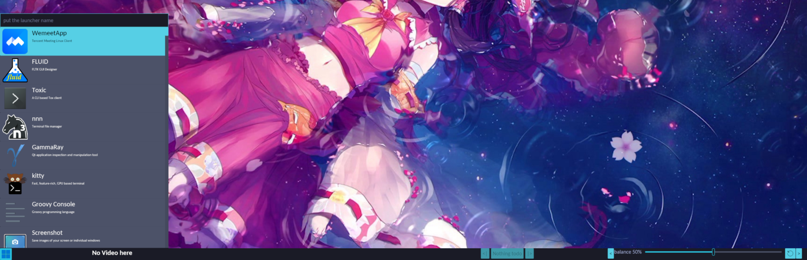

# Extra wayland shell event loop and their iced bindings

We want to make program with iced for layershell and sessionlock, so we made this project.

Take winit as reference a lot, to make easilier program on layershell and ext-session-lock.

This project bind `ext-session-lock` and `layershell` with the similar way of winit, which storing message and handle it in callback

## Here are five subprojects

### waycrate_xkbkeycode

Take a lot of reference from winit (mainly from winit). Mainly handle the xkbcommon events.

### layershellev

Winit like layershell event crate.

We use it make a virtual-keyboard program, please take a look at `starcolorkeyboard`. Next we will make the program with iced-layershell instead, to provide a more beautiful virtual-keyboard program.

### sessionlockev

Winit like sessionlock event crate. It handles the sessionlock event, like lock and unlock, and provides base support for iced binding for sessionlock

### iced-layershell

iced binding for layershell

#### Feature:

- support to open new layershell and support popup window.
- support ext-virtual-keyboard

With this crate, you can use iced to build your kde-shell, notification application, and etc.

### iced-sessionlock

iced binding for sessionlock

Session lock is the wayland protocol for lock. This protocol is supported in river, sway and etc. We use it make a beautiful lock program in [twenty](https://github.com/waycrate/twenty). You can also use it to build your sessionlock. This will become very easy to use our crate with pam crate.

## Help Us

in iced 0.13, there will be breaking changes, we need someone who are familiar with iced to help us. And text-input-v3 and input-method also not handled, we also need some help since ime feature will be support in iced 0.13, we think this feature is very important, we need prepare for it.
