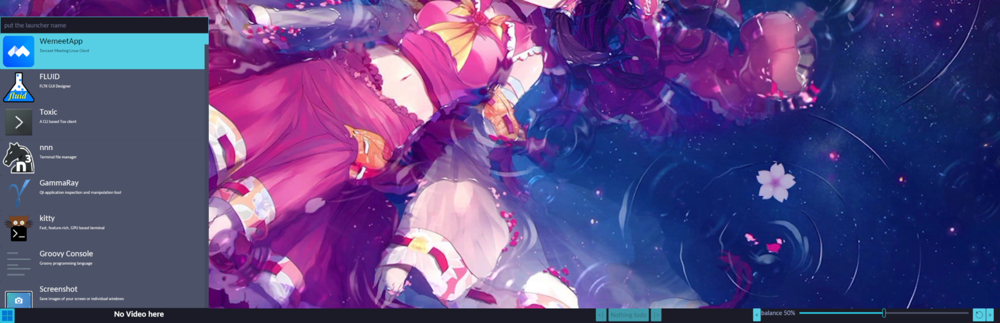

# Extra wayland shell event loop and their iced bindings

We want to make program with iced for layershell and sessionlock, so we made this project.

Take winit as reference a lot, to make easilier program on layershell and ext-session-lock.

This project bind `ext-session-lock` and `layershell` with the similar way of winit, which storing message and handle it in callback

## How can it do such thing?

Iced itself does not support to add extra custom system actions or extra system events, but we can do something to Message. We add some genertic type restriction to the message, and let message can be changed to events or actions during eventloop, so you need to use the macros, and add extra fields to your `Message`. And I am lazy about writing the documents, so if you do not understand how to use this crate, you can always ask questions in discord channels, open issues or make pr for us. By the way, about custom events, we have pr about it at https://github.com/iced-rs/iced/pull/2658.

And we also support popup in these shells, but since the popup/tooltip support has not landed in winit/iced, so it seems only a toy. I have consider about a design for it, but I do not have time to implement it, and I need to read the code about iced.

Always welcome pr and issues!

## Here are seven subprojects

### waycrate_xkbkeycode

Take a lot of reference from winit (mainly from winit). Mainly handle the xkbcommon events.

### layershellev

Winit like layershell event crate.

### sessionlockev

Winit like sessionlock event crate. It handles the sessionlock event, like lock and unlock, and provides base sessionlock support for iced_sessionlock

### exwlshellev

All extra wayland shell in one eventloop. This libraries provides full extra shell support for iced_exwlshell

### iced_layershell

Layershell binding for iced

#### Feature:

- support to open new layershell and support popup window.
- support ext-virtual-keyboard

With this crate, you can use iced to build your kde-shell, notification application, and etc.

### iced_sessionlock

Sessionlock binding for iced

Session lock is the wayland protocol for lock. This protocol is supported in river, sway and etc. We use it make a beautiful lock program in [twenty](https://github.com/waycrate/twenty). You can also use it to build your sessionlock. This will become very easy to use our crate with pam crate.

### iced_exwlshell

Full extra shell binding for iced

Now you can use this crate to make a shell probram, including lock, dock, and etc
